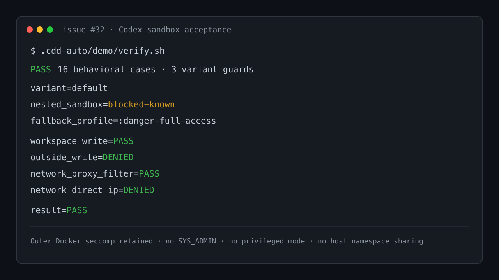

# Demo — Codex bubblewrap behavior inside the agent container

Source: GitHub issue [#32](https://github.com/maximalfocus/coding-agent-sandbox/issues/32)

This demo proves the selected safe behavior without weakening Docker's outer boundary. It uses Codex's local `sandbox` command, so it requires neither model inference nor OpenAI authentication.

## Preconditions

- The default sandbox is running as container `claude-sandbox` and healthy.
- Run from the repository root.
- The image contains the pinned Codex CLI; Debian bubblewrap is not installed merely to hide its warning.

## Scenario 1 — Fail closed on nested-sandbox classification

1. Run 16 deterministic behavioral cases through the verifier's Docker boundary.
2. **Expected:** bundled and Debian namespace messages both classify as `blocked-known`.
3. **Expected:** missing Codex, unknown errors, malformed output, proxy-open, direct-IP-open, and five unsafe live-control fixtures all fail.
4. **Expected:** no path treats `--version` as functional evidence.

## Scenario 2 — Execute a real Codex Linux-sandbox command

1. Inspect the live container and require non-privileged mode, `cap_drop: ALL`, no `SYS_ADMIN`, `no-new-privileges`, and active seccomp.
2. Invoke `codex sandbox -P :workspace` with a command that writes in its workspace, attempts an outside write, and attempts network access.
3. On the shipped Docker profile, accept only the exact bubblewrap namespace-init failure.
4. Invoke the documented `:danger-full-access` fallback inside the outer container.
5. **Expected:** workspace write succeeds; `/etc` write fails; non-allowlisted proxy request returns 403; direct-IP request fails.

## Scenario 3 — Preserve every shipped variant's outer controls

1. Parse rendered Compose JSON for default, MITM, and sidecar profiles.
2. **Expected:** every service drops all capabilities first, retains NNP, and has no privileged mode, `SYS_ADMIN`, host namespace sharing, or unconfined seccomp.
3. Live probes were also run against `claude-sandbox`, `claude-sandbox-mitm`, and `claude-sandbox-node`; all selected the known fallback and passed the same filesystem/network restrictions. The sidecar agent correctly used its `HTTP_PROXY=http://claude-sandbox-egress:8888` override.

## Run

```bash
.cdd-auto/demo/verify.sh
```

Pinned output is diffed byte-for-byte before it is printed. A difference or missing restriction exits nonzero.


