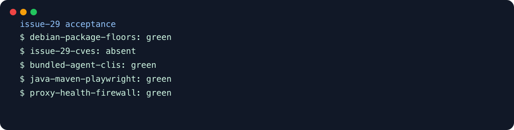

# Issue 29 acceptance demo

The rebuilt sandbox image upgrades the Debian ImageMagick family and Linux development headers while preserving the assembled developer-tool and network-isolation behavior.

## Run

```sh
docker compose build claude-sandbox
.cdd-auto/demo/verify.sh
```

The verifier performs a fresh HIGH/CRITICAL Trivy JSON scan, checks every installed ImageMagick-family package with Debian version semantics, rejects all 15 issue CVEs, starts the npm-installed agent CLIs, recreates the sandbox from the patched image, starts Java/Maven/Playwright as the unprivileged runtime user, checks container health, proves the proxy refuses a non-allowlisted host with HTTP 403, and proves a direct proxy bypass cannot connect.

Expected byte-stable stdout:

```text
debian-package-floors: green
issue-29-cves: absent
bundled-agent-clis: green
java-maven-playwright: green
proxy-health-firewall: green
```



## Negative proof

`verify.sh` diffs actual output against `expected-output.txt`. Supplying a changed expected file must fail; missing/empty/malformed/no-results/affected-CVE Trivy evidence is independently mutation-tested against `scripts/verify-debian-security.sh`.

The build and live Trivy scan use Docker state/cache and require registry/network access on a cold cache. Verification shown is arm64; the Dockerfile and named Debian packages are architecture-neutral across the base image's amd64/arm64 manifest.
