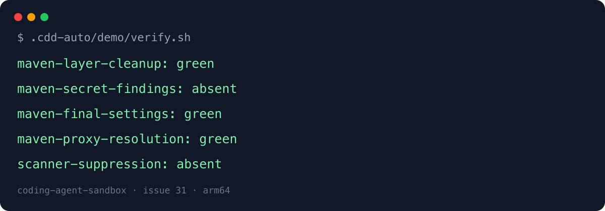

# Issue 31 acceptance demo

The rebuilt sandbox image removes Debian Maven's example settings before the apt-install layer is committed, while the final image retains the project-owned proxy configuration and Maven still resolves dependencies through the running sandbox proxy.

## Run

```sh
docker compose build claude-sandbox
.cdd-auto/demo/verify.sh
```

The verifier checks Dockerfile instruction ordering, rejects scanner suppression, byte-compares the final image settings with `maven-settings.xml`, runs a fresh Trivy secret scan tied to the inspected image layers, recreates the sandbox, and resolves Commons Lang 3.17.0 as the unprivileged `node` user into a fresh temporary Maven repository.

Expected byte-stable stdout:

```text
maven-layer-cleanup: green
maven-secret-findings: absent
maven-final-settings: green
maven-proxy-resolution: green
scanner-suppression: absent
```



## Negative proof

`verify.sh` diffs actual output against `expected-output.txt`; changing the expected output must fail. The conformance verifier is mutation-tested so a later-layer deletion, `.trivyignore`, missing/malformed/no-results/foreign-layer Trivy evidence, or either Maven password/passphrase rule is red.

The build, live Trivy scan, container recreation, and first Maven dependency resolution use Docker state/cache and require registry/network access on a cold cache. Verification shown is arm64; the Dockerfile operations and Maven package path are architecture-neutral across the base image's amd64/arm64 manifest.
