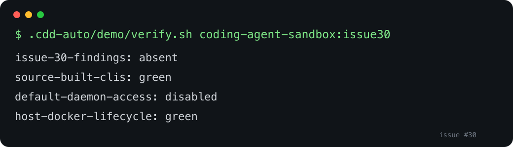

# Issue 30 acceptance demo

The sandbox builds GitHub CLI, Docker Buildx, and Docker Compose from immutable upstream commits with Go 1.26.5, removing the fixed HIGH findings embedded in the previously packaged binaries while preserving Docker CLI operation and the daemon-access boundary.

## Run

```sh
docker build -t coding-agent-sandbox:issue30 .
.cdd-auto/demo/verify.sh coding-agent-sandbox:issue30
```

The verifier performs a fresh HIGH/CRITICAL Trivy vulnerability scan, binds the report to the exact image tag, requires all three affected binary targets, runs every CLI as `node`, proves the default image cannot access a Docker daemon, then explicitly grants the host socket and exercises build → start → health → remove with a uniquely named disposable image/container.

Expected byte-stable stdout:

```text
issue-30-findings: absent
source-built-clis: green
default-daemon-access: disabled
host-docker-lifecycle: green
```



## Negative proof

`verify.sh` diffs stdout byte-for-byte against `expected-output.txt`. The underlying security verifier mutation-tests affected-CVE, missing-target, foreign-image, malformed, and missing scan evidence. Supplying a modified expected-output file must fail.

The source build and live scan require network/registry access on a cold cache. The host-Docker scenario is intentionally high impact but opt-in and disposable; the default-daemon-denial check runs first and remains the normal product boundary. Verification shown is arm64; the build script accepts only Linux `amd64` and `arm64`, and all compiled inputs are architecture-neutral Go sources.
