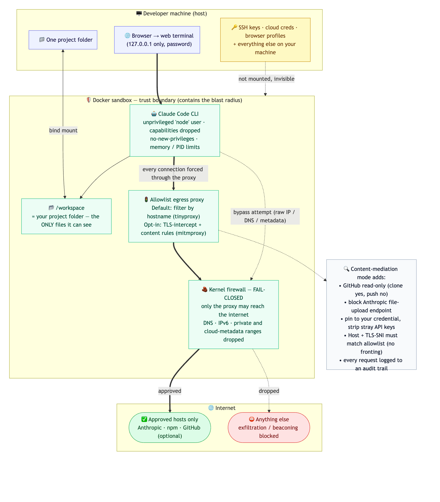
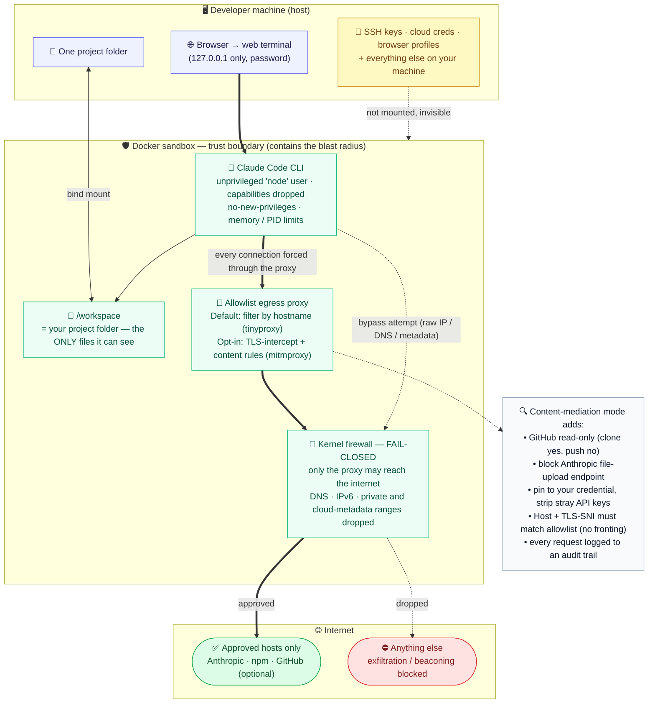

# Claude Code Sandbox — Security Architecture

One-page executive view of how we run the real Claude Code agent while **containing what it can
touch**. It mirrors the *environment layer* of Anthropic's
["How we contain Claude"](https://www.anthropic.com/engineering/how-we-contain-claude)
defense-in-depth model, and was independently peer-reviewed (cross-vendor) to convergence.

> Rendered image above (works everywhere). Source of truth: [`security-architecture.mmd`](./security-architecture.mmd).
> High-resolution vector: [`security-architecture.svg`](./security-architecture.svg).
> To edit: paste the `.mmd` into <https://mermaid.live> and re-export the PNG/SVG.

## The three controls that matter (read the diagram top → bottom)

1. **Containment** — the agent runs inside a Docker sandbox, as an unprivileged user, with Linux
   capabilities dropped, `no-new-privileges`, and memory/PID limits. A compromised or
   prompt-injected agent is confined to the box.
2. **Data minimization** — it can see exactly **one folder** you choose. SSH keys, cloud
   credentials, and the rest of the machine are never mounted, so they are invisible to it.
3. **Fail-closed egress** — all network traffic is forced through an allowlist proxy, and a kernel
   firewall ensures **nothing can go around it** (direct IPs, DNS, IPv6, and cloud-metadata are
   dropped). The agent can reach approved hosts (Anthropic, npm, optionally GitHub) and **nothing
   else** — so it cannot beacon out or exfiltrate to an arbitrary server.

The optional **content-mediation mode** goes a layer deeper: it terminates TLS to inspect the
traffic itself (GitHub read-only, blocks the Anthropic file-upload endpoint, pins the credential,
defeats Host/SNI spoofing) and writes a full audit log.

## Honest boundary (what it does *not* do)

- Your code **is** sent to Anthropic for inference — by design. This contains the blast radius on
  *your machine*; it does not make source private from the model provider.
- An allowlisted host is a *trust grant*: data could still leave via a host you explicitly approve
  (that is why GitHub is a deliberate, separable toggle and the allowlist is kept minimal).
- It is a strong container boundary, not a full VM/hypervisor boundary (gVisor is a one-line opt-in
  if a kernel-escape boundary is required).

---

Mermaid source (for tools that render Mermaid inline)

