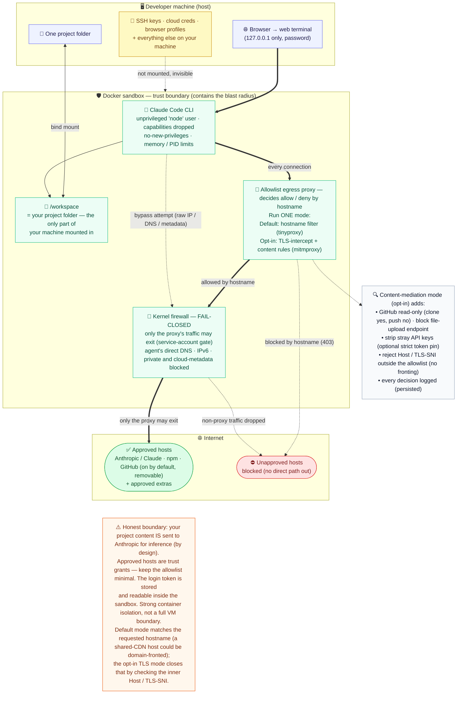

# Claude Code Sandbox — Security Architecture

One-page executive view of how we run the real Claude Code agent while **containing what it can
touch**. It mirrors the *environment layer* of Anthropic's
["How we contain Claude"](https://www.anthropic.com/engineering/how-we-contain-claude)
defense-in-depth model, and was independently peer-reviewed (cross-vendor) to convergence.

> Rendered image above (works everywhere). Source of truth: [`security-architecture.mmd`](./security-architecture.mmd).
> High-resolution vector: [`security-architecture.svg`](./security-architecture.svg).
> To edit: paste the `.mmd` into <https://mermaid.live> and re-export the PNG/SVG.

## The three controls that matter (read the diagram top → bottom)

1. **Containment** — the agent runs inside a Docker sandbox, as an unprivileged user, with Linux
   capabilities dropped, `no-new-privileges`, and memory/PID limits. A compromised or
   prompt-injected agent is confined to the box.
2. **Data minimization** — of *your machine*, the only thing mounted in is the **one project folder**
   you choose. SSH keys, cloud credentials, and the rest of your home are never mounted, so they are
   invisible to it. (Inside the box it can of course read the container's own OS files and its
   `~/.claude` config — which includes the login token; see *Honest boundary*.)
3. **Fail-closed egress** — all traffic is forced through an allowlist proxy that **decides allow/deny
   by hostname**, and a kernel firewall enforces that **only the proxy's own traffic may leave**
   (a service-account gate). The agent's direct DNS, IPv6, and private/cloud-metadata ranges are
   blocked, so it **cannot go around the proxy**. It can reach approved hosts (Anthropic/Claude, npm,
   GitHub by default, plus any extras you add) and no unapproved host — so it cannot beacon to an
   arbitrary server. (The default mode matches on the *requested hostname*; a shared-CDN host that
   also serves an approved domain could in principle be domain-fronted — the opt-in content-mediation
   mode closes that by checking the inner `Host`/TLS-SNI.)

The optional **content-mediation mode** goes a layer deeper: it terminates TLS to inspect the
traffic itself — GitHub read-only (clone yes, push no), blocks the Anthropic file-upload endpoint,
strips stray API keys (with an optional strict token pin), rejects any `Host`/TLS-SNI outside the
allowlist (no domain fronting), and writes a persisted request-decision log.

## Honest boundary (what it does *not* do)

- Your code **is** sent to Anthropic for inference — by design. This contains the blast radius on
  *your machine*; it does not make source private from the model provider.
- An allowlisted host is a *trust grant*: data could still leave via a host you explicitly approve
  (that is why GitHub is a deliberate, separable toggle and the allowlist is kept minimal).
- The subscription **login token is stored and readable inside the sandbox** (`~/.claude` config
  volume), so the agent can read its own credential — it is contained, not hidden from the model.
- It is a strong container boundary, not a full VM/hypervisor boundary (gVisor is a one-line opt-in
  if a kernel-escape boundary is required).

---

Mermaid source (for tools that render Mermaid inline)

