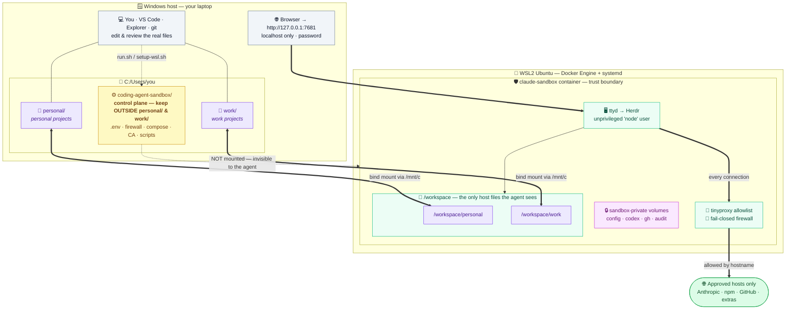

# System design — host, WSL, container & the workspace mapping

How the pieces fit together on a Windows + WSL2 install, and **how your `personal` / `work`
project trees map into the sandbox**. For the egress/trust-boundary view, see
[`security-architecture`](./README.md).
This diagram describes the default, contained configuration; the host Docker override is outside
that boundary and is documented in [`SECURITY.md`](../../SECURITY.md).

## How to read it

- **Two project trees, kept separate.** Your host `personal/` and `work/` folders bind-mount to
  `/workspace/personal` and `/workspace/work`. Inside one session the agent can work across both
  while they stay organised as distinct trees — and because they're **live bind mounts**, every
  change is the same file on the host: edit/inspect it in **VS Code**, review it with **git**, or
  open it in **Explorer** — no copy, no sync.
- **The sandbox repo is the control plane and stays OUTSIDE both trees.**
  `coding-agent-sandbox/` holds the things that *contain* the agent — `.env` (the web-terminal
  password and any `GITHUB_TOKEN`), the egress allowlist (`init-firewall.sh`, `tinyproxy.conf`),
  the `docker-compose.yml` capability drops, and the CA. The agent only ever sees `/workspace`, so
  if the repo lived inside `personal/` or `work/` the agent could **read those secrets and rewrite
  its own guard rails**. Keeping it outside means the machinery is invisible and unmodifiable from
  inside the box. (`run.sh` / `run.ps1` also refuse to mount `$HOME` or sensitive dirs for the same
  reason.)
- **Logins persist in sandbox-private named volumes** (`config`, `codex`, `gh`, `audit`) — not on
  your project trees — so they survive restarts without widening what the agent can read.
- **All egress is mediated**: the agent reaches only approved hosts through the hostname allowlist,
  behind a fail-closed kernel firewall.
